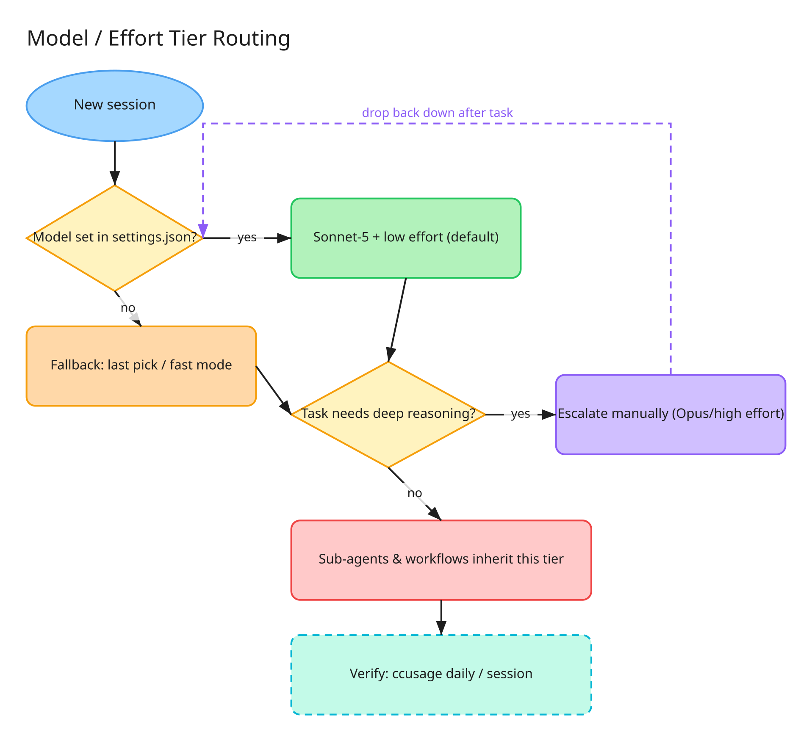
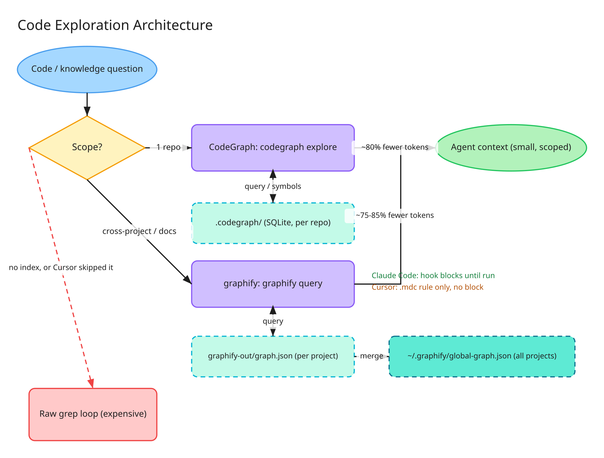
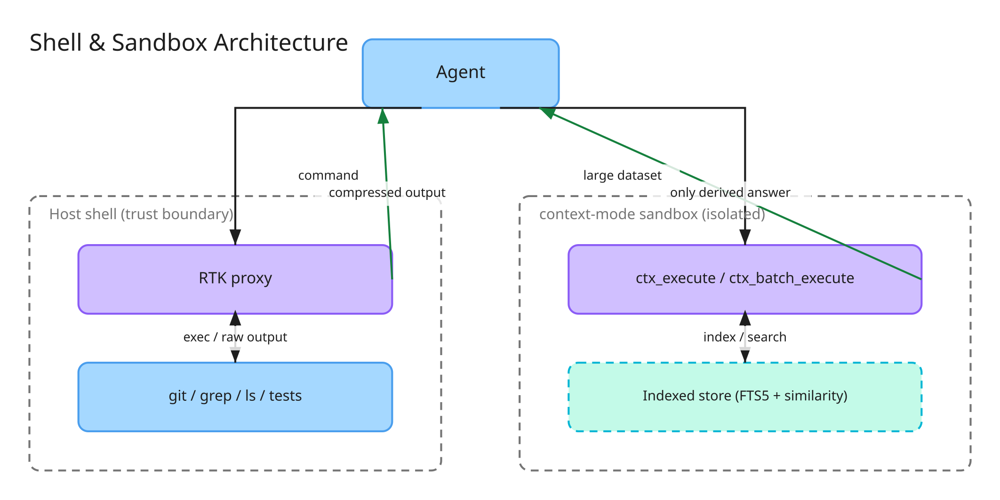
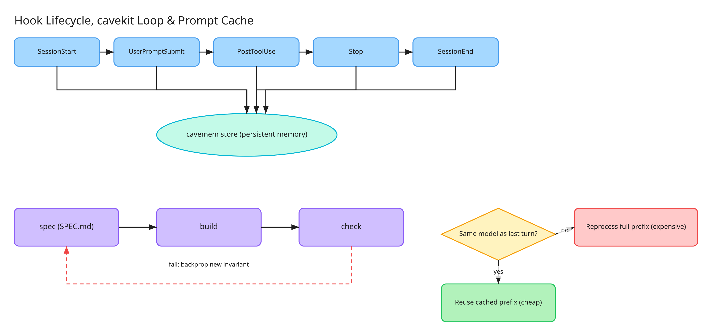

# TokenSip

> Session cost scales by model tier × effort × turns × context size × output size, not by prompt count. Model/effort tier is the biggest lever. Context that stays in the conversation and gets resent every turn is the second.

---

## Check this first: model tier and effort

```bash
npx ccusage@latest daily     # cost per day, split by model, reads local logs only
npx ccusage@latest session   # cost per session, finds outlier sessions
```

Top-tier models cost several times more per token than mid-tier, for comparable results on most day-to-day work. Model tier is a straight multiplier on every token, tool-level compression below is not.

**Set the default, don't rely on remembering it.** `~/.claude/settings.json`:

```json
{
  "model": "claude-sonnet-5",
  "effortLevel": "low"
}
```

- No `model` key → falls back to last manual pick, or to a "fast"/highest-tier mode if the harness has one.
- Escalate manually, per task: architecture, hard debugging, ambiguous design. Drop back down after.
- Sub-agents and background workflows inherit the parent session's tier. A top-tier session fans out top-tier cost to every dispatched agent.
- Switching model mid-session breaks prompt cache, reprocesses the whole prefix. Batch tier changes at session boundaries.
- Re-check with `ccusage` periodically, defaults drift silently.



---

## Works in both Claude Code and Cursor

### CodeGraph

Per-repo symbol/call graph (SQLite), `.codegraph/` at project root.

```bash
codegraph explore "<question>"        # shell
codegraph_explore("<question>")       # MCP
```

Verbatim, line-numbered source for the relevant symbols, plus call paths (including dynamic dispatch, grep can't follow that). Replaces the grep → Read loop with 1 call.

**Measured** (real query, RUM instrumentation flow): ~2.8K tokens with CodeGraph vs ~14-15K without (grep loop + full-file reads + one wrong file). **~80% savings.**

Auto-injects a hint every prompt:

```json
"UserPromptSubmit": [
  { "hooks": [ { "type": "command", "command": "codegraph prompt-hook" } ] }
]
```

No `.codegraph/` in a directory → tool doesn't apply, indexing is opt-in (`codegraph init`).

### graphify

Broader knowledge graph: code + docs + config + any input, community detection. Per-project (`graphify-out/graph.json`) plus one merged global graph (`~/.graphify/global-graph.json`).

```bash
graphify query "<question>"                                        # this project
graphify query "<question>" --graph ~/.graphify/global-graph.json  # all merged projects
graphify path "<A>" "<B>"
graphify explain "<concept>"
```

**Estimated:** ~1-3K tokens per scoped query vs ~10-20K reading the full `GRAPH_REPORT.md` or grep-looping. **~75-85%.**

**Claude Code: real hook, not just a reminder.** `graphify claude install` (run once, from the user's home directory so it lands in the global `~/.claude/settings.json`, not a project-local one) registers a `PreToolUse` hook that blocks `Bash|Grep` and `Read|Glob` until `graphify query` has run, matching CodeGraph's automation tier:

```json
"PreToolUse": [
  { "matcher": "Bash|Grep", "hooks": [ { "type": "command", "command": "graphify hook-guard search" } ] },
  { "matcher": "Read|Glob", "hooks": [ { "type": "command", "command": "graphify hook-guard read" } ] }
]
```

**Cursor: still just a reminder, not a real block.** `graphify cursor install` writes a `.cursor/rules/graphify.mdc` (`alwaysApply: true`), but Cursor has no equivalent blocking mechanism, confirmed in the tool's own source, not a config gap to fix. Forgetting it exists there still regresses straight back to raw grep.

```bash
graphify extract . --backend claude-cli --global --as "<project-name>"
graphify export obsidian --graph ~/.graphify/global-graph.json --dir <vault-dir>
```

### Obsidian vault

Human-readable layer over the merged global graph. Ready-made table views: Everything, By community, Code only, Rationale, Concepts, Documents, Communities.

Not itself a token saver, `graphify query`/`explain`/`path` are. It's for browsing the graph instead of asking the agent to re-summarize it.

Re-indexing many projects back to back can spawn several model subprocesses at once and exhaust memory, do one at a time.

A scheduled low-priority job (e.g. launchd, ~4h interval, skips if a session is active or load is high) can re-merge and re-export automatically, only when a project's graph actually changed.



### RTK

Compresses shell output (`git status`, `grep`, `ls`, tests) before it hits context.

```json
"PreToolUse": [
  { "matcher": "Bash", "hooks": [ { "type": "command", "command": "rtk hook claude" } ] }
]
```

Transparent once wired: `git status` → `rtk git status` automatically.

```bash
rtk gain              # cumulative savings, native telemetry
rtk discover           # missed opportunities in history
rtk proxy <cmd>        # raw, unfiltered (debugging)
rtk -vv <cmd>          # verbose, still filtered
```

**Measured, native telemetry:** 70-90% savings per command on `ls`/`grep` in practice. Only number in this doc backed by the tool's own telemetry, not estimate.

**Debugging rule:** compressed output can hide the detail that matters. Root cause not obvious → `rtk -vv` or `rtk proxy` before concluding anything. Never `-u`/`--ultra-compact` while debugging. Failed commands keep full unfiltered output on disk (`~/.local/share/rtk/tee/`), check that file first.

### caveman suite

Same author, one package, three pieces:

| Piece | What it does |
|---|---|
| **caveman** | Compresses the agent's own prose (drops articles/filler/pleasantries, keeps code/commands verbatim) |
| **cavekit** | `grill → spec → research → review → build → check` loop over one `SPEC.md`, no sub-agents |
| **cavemem** | Persistent memory across sessions |

**caveman levels:**

| Level | When |
|---|---|
| `lite` | Default |
| `full` | Routine/repetitive stretches |
| `ultra` | Subagent-to-subagent only, never user-facing |
| `wenyan` | Not worth the loss |

Drop back to full uncompressed language for: security warnings, irreversible-action confirmations, multi-step sequences where a dropped word risks misreading, user confusion.

**cavekit skills:** everyday, `spec`/`build`/`check`. Situational, `grill`/`research`/`review`/`deepen`/`backprop`.

**Isolated benchmark** (same task: one Python function + pytest suite, two separate repos, one framework forced per repo):

| | cavekit | sub-agent-phased framework |
|---|---|---|
| Tool calls | 23 | 25 |
| Wall time | ~57 min | ~106 min |
| Result | 8/8 tests | 8/8 tests (same) |
| Process artifacts | ~30-line `SPEC.md` | ~170 lines of design+plan docs for ~70 lines of code+tests |

cavekit used meaningfully fewer tokens for the same passing result. One small task, doesn't generalize to every scale, large/ambiguous multi-feature work is where the heavier framework earns its overhead. Pick one per task.

---

## Claude Code only

### context-mode

Runs processing in an isolated sandbox, indexes the result, returns only the derived conclusion. RTK compresses one command's output, context-mode processes (filter/count/aggregate) a whole dataset without raw bytes touching the conversation.

```
ctx_batch_execute(commands, queries)   # parallel run, indexed, matching snippets returned
ctx_search(queries: [...])              # search indexed content + session memory
ctx_execute(language, code)             # only print() output enters context
ctx_fetch_and_index(url)                # index a page instead of pulling it whole
```

**Decision:** processing (filter/count/parse) → context-mode. Observing a short fixed result, or mutating state (`git`, `mkdir`, `rm`) → plain call. Summarizing a file → `ctx_execute_file`. Editing a file → plain read (editor needs exact bytes).

`ctx_search(sort: "timeline")` pulls captured decisions/errors/prompts, survives clear/compact.



### cavemem automation

```json
"SessionStart":     [{ "hooks": [{ "type": "command", "command": "cavemem hook run session-start" }] }],
"UserPromptSubmit": [{ "hooks": [{ "type": "command", "command": "cavemem hook run user-prompt-submit" }] }],
"PostToolUse":      [{ "hooks": [{ "type": "command", "command": "cavemem hook run post-tool-use" }] }],
"Stop":             [{ "hooks": [{ "type": "command", "command": "cavemem hook run stop" }] }],
"SessionEnd":       [{ "hooks": [{ "type": "command", "command": "cavemem hook run session-end" }] }]
```

No manual step, capture just happens.



---

## Cursor only

Nothing today. Every tool above runs the same in both editors, or is Claude-Code-only with a lighter Cursor equivalent (table below).

---

## Real hook vs. rule-that-needs-a-habit

| Tool | Claude Code | Cursor |
|---|---|---|
| CodeGraph | Auto, `UserPromptSubmit` hook | MCP, same auto hint |
| graphify | `PreToolUse` hook (`hook-guard search`/`read`), always on since `graphify claude install` | `alwaysApply` rule, doesn't block |
| RTK | `PreToolUse` hook, always on | Equivalent hook, always on |
| caveman | Active plugin | Editor rule, same effect |
| cavekit | Skill system | Symlinked skills |
| cavemem | Hook, every lifecycle event | MCP query-only, no auto capture |
| context-mode | MCP plugin | Not configured |

**Rule of thumb:** a real hook fires on its own. A skill/rule relies on the agent remembering to invoke itself, not forced.

---

## Prompt caching

- Session inside the cache TTL reuses the processed prefix, pays only the delta.
- Model switch mid-session breaks the cache.
- CodeGraph/graphify/RTK/context-mode shrink the prefix to cache. cavemem preserves it across sessions via retrieved memory.
- Re-emitting a large artifact (JSON, report, dashboard) twice in one session: new output, zero cache reuse, inflates recall next turn. Save to file, reference path, edit in place.

## The prompt

Full operating prompt, concrete rules/commands/hook JSON, no vague advice: [`CLAUDE.md`](https://github.com/ssnivlek/tokensip/blob/main/CLAUDE.md).

## Quick decisions

| Situation | What to do |
|---|---|
| New setup, or haven't checked in a while | `ccusage daily`/`session`, confirm the defaults |
| Question about code in one repo | CodeGraph |
| Broad question, cross-project, or docs | graphify |
| Running a shell command | Let RTK intercept it |
| Debugging an active failure, RTK doesn't add up | `rtk -vv` or `rtk proxy` |
| Processing/filtering/counting a large dataset | context-mode |
| Observing a short result or mutating state | Plain call |
| Spec/plan/implementation | cavekit, not a sub-agent framework by default |
| Genuinely large/ambiguous multi-feature work | The heavier framework may earn it here |
| Switching to an unrelated task | Clear or compact |
| About to re-emit a large report/JSON again | Don't, save to a file |
| Task genuinely needs heavy reasoning | Escalate model/effort manually, then drop back |
